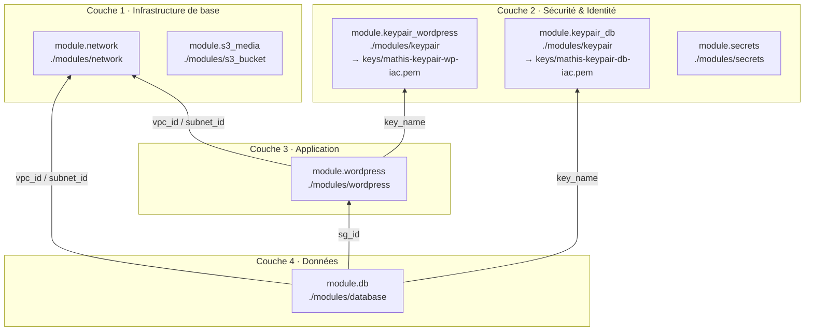

> Auteurs : Mathis LACEPPE,
> Alexandre CATHELIN,
> Nino SAPIN

## Architecture

## Structure des fichiers Terraform

| Fichier | Rôle |
|---|---|
| `terraform.tf` | Déclare les providers requis (AWS, TLS, HTTP, Random, Local) et le backend S3 pour le state distant |
| `providers.tf` | Configure le provider AWS : région `eu-west-1` et tags par défaut appliqués à toutes les ressources |
| `locals.tf` | Centralise la convention de nommage `mathis-<nom>-iac` pour toutes les ressources |
| `data.tf` | Datasources : AZs disponibles, AMI Amazon Linux 2023 la plus récente, IP publique via checkip.amazonaws.com |
| `network.tf` | VPC, Internet Gateway, sous-réseaux publics et privés (un par AZ), route tables publique et privée |
| `security_groups.tf` | Firewall WordPress (HTTP/HTTPS/SSH) et firewall DB (MySQL depuis WP + SSH), SSH restreint à l'IP publique |
| `keypair.tf` | Génère une clé RSA 4096 bits, la pousse dans AWS et sauvegarde le `.pem` localement |
| `instances.tf` | Instance WordPress via le module `modules/wordpress` (sous-réseau public) et instance DB (sous-réseau privé) |
| `s3.tf` | Bucket S3 pour les médias WordPress : accès public bloqué, versioning activé, chiffrement AES-256 |
| `secrets.tf` | Génère et stocke dans AWS Secrets Manager les mots de passe DB root et WordPress admin |
| `outputs.tf` | Expose les valeurs utiles : IP WordPress, IP DB, nom du bucket S3, ARNs des secrets |
| `main.tf` | Point d'entrée (vide, réservé pour extensions futures) |

### Module

| Fichier | Rôle |
|---|---|
| `modules/wordpress/main.tf` | Crée une instance EC2 t3.micro avec disque gp2 10GB |
| `modules/wordpress/variables.tf` | Variables du module : nom, prefix, AMI, subnet, security group, key pair |
| `modules/wordpress/outputs.tf` | Expose l'ID, l'IP publique et l'IP privée de l'instance |

### GitHub Actions

| Fichier | Rôle |
|---|---|
| `.github/workflows/terraform-plan.yml` | Sur chaque Pull Request : exécute `terraform plan` et poste le résultat en commentaire |
| `.github/workflows/terraform-apply.yml` | Sur chaque push sur `main` : exécute `terraform apply` automatiquement |

<!-- BEGIN_TF_DOCS -->
## Dépendances entre modules

## Modules

The following Modules are called:

###  [db](#module\_db)

Source: ./modules/database

Version:

###  [keypair\_db](#module\_keypair\_db)

Source: ./modules/keypair

Version:

###  [keypair\_wordpress](#module\_keypair\_wordpress)

Source: ./modules/keypair

Version:

###  [network](#module\_network)

Source: ./modules/network

Version:

###  [s3\_media](#module\_s3\_media)

Source: ./modules/s3_bucket

Version:

###  [secrets](#module\_secrets)

Source: ./modules/secrets

Version:

###  [wordpress](#module\_wordpress)

Source: ./modules/wordpress

Version:

## Required Inputs

No required inputs.

## Optional Inputs

No optional inputs.

## Outputs

The following outputs are exported:

###  [db\_private\_ip](#output\_db\_private\_ip)

Description: Private IP of the DB instance

###  [db\_root\_password\_secret\_arn](#output\_db\_root\_password\_secret\_arn)

Description: ARN of the Secrets Manager secret holding the DB root password

###  [keypair\_db\_name](#output\_keypair\_db\_name)

Description: Name of the DB SSH key pair

###  [keypair\_db\_path](#output\_keypair\_db\_path)

Description: Local path to the DB .pem file

###  [keypair\_wordpress\_name](#output\_keypair\_wordpress\_name)

Description: Name of the WordPress SSH key pair

###  [keypair\_wordpress\_path](#output\_keypair\_wordpress\_path)

Description: Local path to the WordPress .pem file

###  [s3\_bucket\_name](#output\_s3\_bucket\_name)

Description: S3 bucket name for WordPress media storage

###  [wordpress\_public\_ip](#output\_wordpress\_public\_ip)

Description: Public IP of the WordPress instance

###  [wp\_admin\_password\_secret\_arn](#output\_wp\_admin\_password\_secret\_arn)

Description: ARN of the Secrets Manager secret holding the WordPress admin password

## Resources

The following resources are used by this module:

- [random_id.s3_suffix](https://registry.terraform.io/providers/hashicorp/random/latest/docs/resources/id) (resource)
- [aws_ami.al2023](https://registry.terraform.io/providers/hashicorp/aws/latest/docs/data-sources/ami) (data source)
- [aws_availability_zones.available](https://registry.terraform.io/providers/hashicorp/aws/latest/docs/data-sources/availability_zones) (data source)
- [http_http.my_public_ip](https://registry.terraform.io/providers/hashicorp/http/latest/docs/data-sources/http) (data source)
<!-- END_TF_DOCS -->
