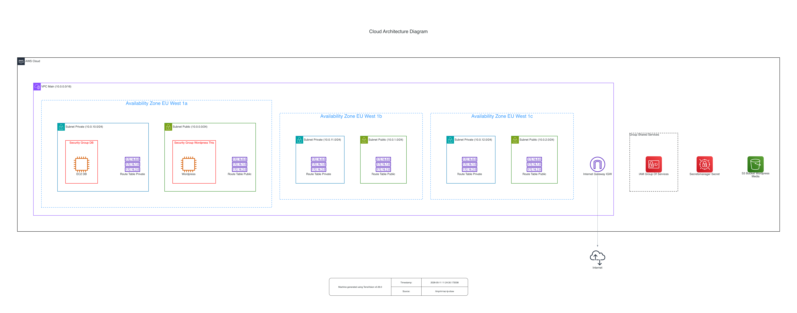
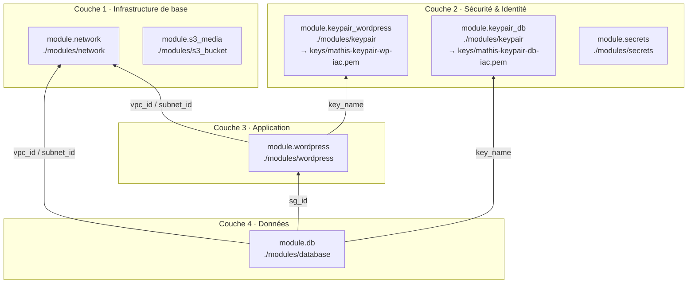

> **Auteurs** : Mathis LACEPPE · Alexandre CATHELIN · Nino SAPIN

## Architecture



## CI/CD

| Workflow | Déclencheur | Action |
|---|---|---|
| `terraform-plan.yml` | Pull Request | `terraform plan` + commentaire sur la PR |
| `terraform-apply.yml` | Push sur `main` | `terraform apply -auto-approve` |

## Récupérer les clés SSH

Les clés sont générées par Terraform et stockées dans AWS Secrets Manager.
Le dossier `keys/` est dans `.gitignore` — à créer une fois par poste de travail.

```bash
mkdir -p keys

# Clé WordPress
aws secretsmanager get-secret-value \
  --region eu-west-1 \
  --secret-id mathis/ssh/wordpress \
  --query SecretString --output text > keys/wordpress.pem
chmod 600 keys/wordpress.pem

# Clé DB
aws secretsmanager get-secret-value \
  --region eu-west-1 \
  --secret-id mathis/ssh/db \
  --query SecretString --output text > keys/db.pem
chmod 600 keys/db.pem
```

## Connexion aux instances

```bash
# WordPress (sous-réseau public)
ssh -i keys/wordpress.pem ec2-user@<wordpress_public_ip>

# DB (sous-réseau privé — via WordPress en bastion)
ssh -i keys/db.pem ec2-user@<db_private_ip>
```

> Les IPs sont disponibles après déploiement : `terraform output`

<!-- BEGIN_TF_DOCS -->
## Dépendances entre modules


<!-- END_TF_DOCS -->
