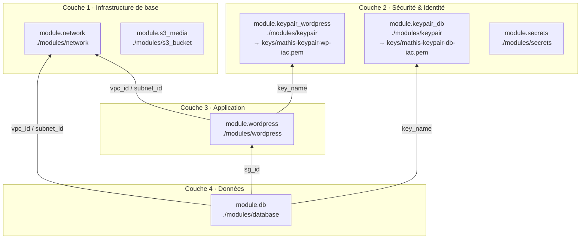

> **Auteurs** : Mathis LACEPPE · Alexandre CATHELIN · Nino SAPIN

## Architecture


## CI/CD

| Workflow | Déclencheur | Action |
|---|---|---|
| `terraform-plan.yml` | Pull Request | `terraform plan` + commentaire sur la PR |
| `terraform-apply.yml` | Push sur `main` | `terraform apply -auto-approve` |
| `ansible-deploy.yml` | Après `terraform-apply.yml` ou manuel | Déploiement Ansible (PostgreSQL + WordPress) |

**Secrets GitHub requis :**

| Secret | Description |
|---|---|
| `AWS_ACCESS_KEY_ID` | Credentials AWS |
| `AWS_SECRET_ACCESS_KEY` | Credentials AWS |
| `TF_STATE_BUCKET` | Nom du bucket S3 pour le state Terraform |
| `VAULT_PASS` | Mot de passe Ansible Vault |

## Récupérer les clés SSH

Les clés sont générées par Terraform et stockées dans AWS Secrets Manager.
Le dossier `keys/` est dans `.gitignore` — à créer une fois par poste de travail.

```bash
mkdir -p keys

# Clé WordPress
aws secretsmanager get-secret-value \
  --region eu-west-1 \
  --secret-id mathis/ssh/wordpress \
  --query SecretString --output text > keys/wordpress.pem
chmod 600 keys/wordpress.pem

# Clé DB
aws secretsmanager get-secret-value \
  --region eu-west-1 \
  --secret-id mathis/ssh/db \
  --query SecretString --output text > keys/db.pem
chmod 600 keys/db.pem
```

## Connexion aux instances

```bash
# WordPress (sous-réseau public)
ssh -i keys/wordpress.pem ec2-user@<wordpress_public_ip>

# DB (sous-réseau privé — via WordPress en bastion)
ssh -i keys/db.pem \
  -o ProxyCommand="ssh -i keys/wordpress.pem -o StrictHostKeyChecking=no -W %h:%p ec2-user@<wordpress_public_ip>" \
  -o StrictHostKeyChecking=no \
  ec2-user@<db_private_ip>
```

> Les IPs sont disponibles après déploiement : `terraform output`

## Ansible

Le déploiement Ansible configure :
- **Instance WordPress** : Nginx + PHP-FPM + WordPress (avec PG4WP pour PostgreSQL)
- **Instance DB** : PostgreSQL 15

### Déploiement automatique

Le workflow `ansible-deploy.yml` s'exécute automatiquement après chaque `terraform apply` réussi.
Il récupère les IPs depuis les outputs Terraform et les clés SSH depuis AWS Secrets Manager.

### Déploiement manuel (local)

**1. Récupérer les clés SSH** (voir section ci-dessus)

**2. Générer et chiffrer les host_vars :**

```bash
cd ansible
echo 'mon_mot_de_passe_vault' > .vault_pass && chmod 600 .vault_pass
bash scripts/update-hosts.sh
```

**3. Lancer le playbook :**

```bash
cd ansible
ansible-playbook site.yml
```

### Structure Ansible

```
ansible/
├── ansible.cfg             # Config : inventory, vault, SSH
├── site.yml                # Playbook principal (3 plays)
├── inventory/
│   └── hosts.yml           # Groupes wordpress / db (sans IPs)
├── group_vars/
│   ├── wordpress.yml       # Vars WordPress (port Nginx, DB host, ...)
│   └── db.yml              # Vars PostgreSQL
├── host_vars/              # Gitignorés — générés après terraform apply
│   ├── wp_host.yml         # ansible_host + clé SSH WordPress
│   └── db_host.yml         # ansible_host + clé SSH DB + ProxyJump
├── roles/
│   ├── common/             # Mises à jour système
│   ├── nginx/              # Nginx
│   ├── php/                # PHP-FPM
│   ├── wordpress/          # WordPress + PG4WP
│   └── postgresql/         # PostgreSQL 15
└── scripts/
    └── update-hosts.sh     # Génère et chiffre les host_vars depuis terraform output
```

### Secrets AWS utilisés par Ansible

| Secret ID | Contenu |
|---|---|
| `mathis/db/root-password` | Mot de passe PostgreSQL |
| `mathis/wordpress/admin-password` | Mot de passe admin WordPress |
| `mathis/ssh/wordpress` | Clé privée SSH instance WordPress |
| `mathis/ssh/db` | Clé privée SSH instance DB |

<!-- BEGIN_TF_DOCS -->
## Dépendances entre modules


<!-- END_TF_DOCS -->
