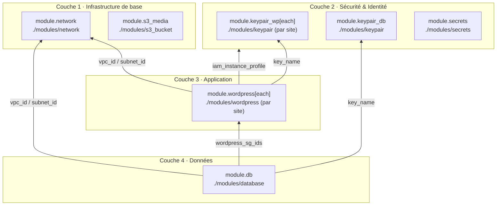

> **Auteurs** : Mathis LACEPPE · Alexandre CATHELIN · Nino SAPIN

## Architecture


Déploiement multi-sites WordPress sur AWS :

- **N instances EC2 publiques** (une par site) : Nginx + PHP-FPM + WordPress + PG4WP
- **1 instance EC2 privée** : PostgreSQL 15 (une base par site : `wp_site1`, `wp_site2`, …)
- **1 bucket S3** : stockage des uploads (sync toutes les 5 min via systemd timer)
- **NAT Gateway** : activé uniquement pendant le déploiement Ansible (économie de coûts)

## Déploiement rapide

```bash
# 1. Copier et configurer le script
cp deploy.sh.changeme deploy.sh

# 2. Renseigner dans deploy.sh :
#    PROJECT_PREFIX="votre-prénom"   # ex: alice
#    AWS_REGION="eu-west-1"

# 3. Configurer les credentials AWS
aws configure

# 4. Lancer
bash deploy.sh
```

Le script gère : bucket S3 Terraform state, `terraform init/apply`, NAT Gateway on/off, chiffrement Ansible Vault, récupération des clés SSH, déploiement Ansible complet.

### Options

```bash
bash deploy.sh --skip-tf       # Rejouer uniquement Ansible (infra déjà déployée)
bash deploy.sh --skip-ansible  # Terraform uniquement
bash deploy.sh --tags wordpress # Rejouer uniquement le rôle wordpress
```

## Sites WordPress

Les sites sont définis dans `variables.tf` (variable `sites`) :

```hcl
variable "sites" {
  default = {
    site1 = { site_title = "WordPress Site 1", admin_user = "admin", admin_email = "admin@site1.example.com" }
    site2 = { site_title = "WordPress Site 2", admin_user = "admin", admin_email = "admin@site2.example.com" }
  }
}
```

Pour ajouter un site, ajouter une entrée et relancer `bash deploy.sh`.

Après déploiement, les URLs et mots de passe admin :

```bash
# IPs
terraform output wordpress_public_ips

# Mot de passe admin (par site)
aws secretsmanager get-secret-value --region eu-west-1 \
  --secret-id "<prefix>/site/<site_key>/admin-password" \
  --query SecretString --output text
```

## Connexion SSH

Les clés sont stockées dans AWS Secrets Manager et récupérées automatiquement par `deploy.sh` dans `/tmp/wp_keys_<prefix>/`.

```bash
# Instance WordPress
ssh -i /tmp/wp_keys_<prefix>/<prefix>-keypair-<site_key>-iac.pem ec2-user@<public_ip>

# Instance DB (via bastion WordPress)
ssh -i /tmp/wp_keys_<prefix>/<prefix>-keypair-db-iac.pem \
  -o ProxyCommand="ssh -W %h:%p -i /tmp/wp_keys_<prefix>/<prefix>-keypair-<site_key>-iac.pem \
    -o StrictHostKeyChecking=no ec2-user@<bastion_public_ip>" \
  ec2-user@<db_private_ip>
```

## S3 — Sync des uploads

Le plugin WP Offload Media Lite est incompatible avec PG4WP (`SHOW TABLES LIKE`, `information_schema`). Les uploads sont synchronisés via un **systemd timer** sur chaque instance :

```
/var/www/wordpress/wp-content/uploads/  →  s3://<bucket>/<site_key>/uploads/
```

- Fréquence : toutes les 5 minutes
- Idempotent (`--delete` : supprime de S3 les fichiers retirés localement)

```bash
# Forcer un sync immédiat
sudo systemctl start wp-s3-sync.service

# Voir le statut
sudo systemctl status wp-s3-sync.timer
```

## Scripts de gestion (ansible/scripts/)

```bash
# Backup d'un site vers S3
bash ansible/scripts/backup.sh site1

# Restaurer depuis le dernier backup
bash ansible/scripts/restore.sh site1

# Restaurer depuis un backup spécifique
bash ansible/scripts/restore.sh site1 20260512_143000

# Rotation des mots de passe (DB + WP admin)
bash ansible/scripts/rotate-passwords.sh site1

# Supprimer un site (avec backup optionnel)
bash ansible/scripts/destroy-site.sh site1

# Mise à jour plugins/thèmes
cd ansible && ansible-playbook playbooks/update.yml
```

## Structure du projet

```
ml-iac-tp/
├── deploy.sh.changeme          # Template de déploiement (à copier en deploy.sh)
├── main.tf                     # Ressources AWS principales (multi-sites)
├── variables.tf                # Variable `sites` + préfixe + région
├── modules/
│   ├── network/                # VPC, subnets public/privé, IGW, NAT Gateway
│   ├── wordpress/              # EC2 + SG + EIP par site
│   ├── database/               # EC2 privée PostgreSQL
│   ├── keypair/                # Génération clé SSH + stockage Secrets Manager
│   ├── s3_bucket/              # Bucket S3 avec versioning et chiffrement
│   └── secrets/                # Secrets Manager (root DB password + clé SSH DB)
└── ansible/
    ├── site.yml                # Playbook principal
    ├── inventory/
    │   ├── hosts.yml           # Généré par Terraform (chiffré Ansible Vault)
    │   └── hosts.yml.tftpl     # Template Terraform → inventaire Ansible
    ├── group_vars/
    │   ├── webservers.yml      # Nginx port, WordPress root, DB port
    │   └── dbservers.yml       # PostgreSQL version et port
    ├── roles/
    │   ├── common/             # Mises à jour système
    │   ├── nginx/              # Nginx + vhost WordPress
    │   ├── php/                # PHP-FPM
    │   ├── wordpress/          # WordPress + PG4WP + WP-CLI + systemd S3 timer
    │   └── postgresql/         # PostgreSQL 15, bases et utilisateurs par site
    └── playbooks/
        ├── update.yml          # Mise à jour plugins/thèmes
        ├── backup.yml          # Backup BDD + uploads vers S3
        ├── restore.yml         # Restauration depuis S3
        ├── rotate-passwords.yml
        └── destroy-site.yml
```

## Secrets AWS

| Secret ID | Contenu |
|---|---|
| `<prefix>/db/root-password` | Mot de passe root PostgreSQL |
| `<prefix>/ssh/db` | Clé privée SSH instance DB |
| `<prefix>/ssh/<site_key>` | Clé privée SSH instance WordPress (par site) |
| `<prefix>/site/<site_key>/db-password` | Mot de passe BDD WordPress (par site) |
| `<prefix>/site/<site_key>/admin-password` | Mot de passe admin WordPress (par site) |

## CI/CD

| Workflow | Déclencheur | Action |
|---|---|---|
| `terraform-plan.yml` | Pull Request | `terraform plan` + commentaire sur la PR |
| `terraform-apply.yml` | Push sur `main` | `terraform apply -auto-approve` |
| `ansible-deploy.yml` | Après `terraform-apply.yml` ou manuel | Déploiement Ansible complet |

**Secrets GitHub requis :**

| Secret | Description |
|---|---|
| `AWS_ACCESS_KEY_ID` | Credentials AWS |
| `AWS_SECRET_ACCESS_KEY` | Credentials AWS |
| `TF_STATE_BUCKET` | Nom du bucket S3 pour le state Terraform |
| `VAULT_PASS` | Mot de passe Ansible Vault |

<!-- BEGIN_TF_DOCS -->
## Dépendances entre modules


<!-- END_TF_DOCS -->
